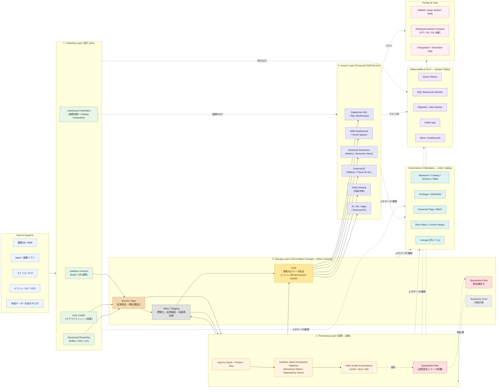

## 全体アーキテクチャ

### 凡例

- **実線矢印**: データ本流 (Source → Bronze → Silver → Gold → 消費)
- **破線矢印**: メタデータ / 監視 / ガバナンス / コスト連携
- **金色ボックス**: Gold / プレゼンテーション層 (業務提供データ製品)
- **銀色ボックス**: Silver / 共通再利用層
- **茶色ボックス**: Bronze / 忠実保全層
- **赤系ボックス**: Quarantine (品質違反の隔離・再処理待ち)
- **灰色ボックス**: Temporary (永続プロダクトではない一時領域)
- **紫破線 (Federation)**: 物理移送せず外部ソースを論理接続する補助経路 (ロジカルSSoT)

### 設計思想の要点

- **Medallion (Bronze / Silver / Gold)** を品質段階の責務分離として中核に据える
- **Unity Catalog** を横断ガバナンス面とし、workspace ではなく metastore 単位で統治する
- **System Tables** を観測・監査・FinOps の共通基盤に使う
- **Governed Self-Service**: ユーザは Gold / Business Semantics を入口にし、Raw / Silver を直接触らせない
- **Federation** は物理SSoTの補助であり、最終的なデータ製品は Medallion で育てる
